<html lang="id">
<head>
  <meta charset="UTF-8">
  <title>Smart Pressure Alert System</title>
  <style>
    body {
      margin: 0;
      font-family: Arial, sans-serif;
      background: linear-gradient(180deg, #6a6fd1, #7c7fd9);
      color: white;
    }
    header {
      text-align: center;
      padding: 80px 20px;
    }
    header h1 {
      font-size: 48px;
      margin-bottom: 10px;
    }
    header p {
      font-size: 20px;
      opacity: 0.9;
    }
    .tags {
      margin-top: 20px;
    }
    .tag {
      display: inline-block;
      background: rgba(255,255,255,0.2);
      padding: 8px 16px;
      border-radius: 20px;
      margin: 5px;
      font-size: 14px;
    }
    section {
      background: rgba(255,255,255,0.1);
      margin: 30px;
      padding: 30px;
      border-radius: 20px;
    }
    h2 {
      margin-top: 0;
    }
    ul {
      line-height: 1.8;
    }
    
<body>

<header>
  <h1>SMART PRESSURE ALERT SYSTEM</h1>
  
Sistem Monitoring Tekanan Berbasis ROS2 Menggunakan Sensor FSR

  

    ESP32
    ROS 2
    FSR Sensor
    Buzzer
    Robotika Medis
  

</header>

<section>
  <h2>Profil Anggota Kelompok</h2>
  

    Nama: Apri Ayu Lia 
    Program Studi: Teknik Biomedis 
    Institusi: Institut Teknologi Sumatera (ITERA) 
    Mata Kuliah: Robotika Medis
  

</section>

<section>
  <h2>Pendahuluan</h2>
  

    Pemantauan kondisi pasien secara berkelanjutan merupakan aspek krusial dalam pelayanan kesehatan, khususnya pada pasien dengan mobilitas terbatas. Salah     satu permasalahan yang sering terjadi adalah tekanan berlebih pada bagian tubuh tertentu akibat posisi statis yang berlangsung lama, yang   dapat menyebabkan ketidaknyamanan hingga risiko luka tekan (pressure ulcer). Pemantauan manual oleh tenaga medis memiliki keterbatasan karena tidak dapat     dilakukan secara terus-menerus.
    Seiring berkembangnya teknologi robotika medis dan sistem cerdas, diperlukan alat pemantauan yang mampu bekerja secara real-time, responsif, dan terintegrasi. Smart Pressure Alert System dikembangkan sebagai solusi berbasis sensor Force Sensitive Resistor (FSR) untuk mendeteksi perubahan tekanan secara akurat. Sistem ini dilengkapi dengan buzzer sebagai peringatan dini ketika tekanan melebihi ambang batas yang ditentukan.
    Integrasi sistem dengan Robot Operating System 2 (ROS 2) memungkinkan pengolahan dan pengembangan data lebih lanjut, seperti monitoring terpusat dan analisis pola tekanan. Dengan desain yang sederhana dan biaya yang relatif rendah, sistem ini memiliki potensi sebagai alat bantu pemantauan pasien yang efektif, sekaligus mendukung penerapan teknologi robotika medis dalam lingkungan pelayanan kesehatan.
  

</section>
<h2>Pentingnya Smart Pressure Alert System</h2>
 <h3>Tekanan Berlebih pada Pasien dengan Mobilitas Terbatas</h3>
  

    Pasien dengan keterbatasan gerak, seperti pasien rawat inap atau rehabilitasi, berisiko mengalami tekanan berlebih pada bagian tubuh tertentu akibat posisi statis dalam waktu lama. Kondisi ini dapat menimbulkan ketidaknyamanan hingga luka tekan (pressure ulcer) apabila tidak terdeteksi sejak dini.
  

  
  <h3>Risiko Keterlambatan Penanganan</h3>
Tekanan yang tidak terpantau dapat berkembang menjadi masalah serius apabila penanganan dilakukan terlambat. Keterlambatan dalam mengetahui perubahan tekanan tubuh pasien dapat memperburuk kondisi klinis dan memperpanjang masa perawatan.
   
   <h3>Keterbatasan Pemantauan Manual</h3>
Pemantauan tekanan tubuh pasien secara manual memiliki keterbatasan karena tidak dapat dilakukan secara kontinu dan sangat bergantung pada kehadiran serta ketelitian tenaga medis. Hal ini meningkatkan risiko terlewatnya kondisi abnormal pada pasien.
   
  <h3>Kebutuhan Sistem Pemantauan Real-Time</h3>
Diperlukan sistem yang mampu melakukan pemantauan tekanan secara real-time dan berkelanjungan. Penggunaan sensor Force Sensitive Resistor (FSR) memungkinkan pembacaan tekanan secara langsung dan responsif terhadap perubahan kondisi pasien.
 
  <h3>Sistem Peringatan Dini Berbasis Teknologi</h3>
Smart Pressure Alert System dilengkapi dengan buzzer sebagai sistem peringatan dini ketika tekanan melebihi ambang batas tertentu. Integrasi dengan Robot Operating System 2 (ROS 2) memungkinkan sistem ini dikembangkan menjadi pemantauan terpusat, sehingga meningkatkan efektivitas dan kecepatan respon dalam pemantauan pasien.
</section>

<h2>Diagram Alir Sistem</h2>
  

  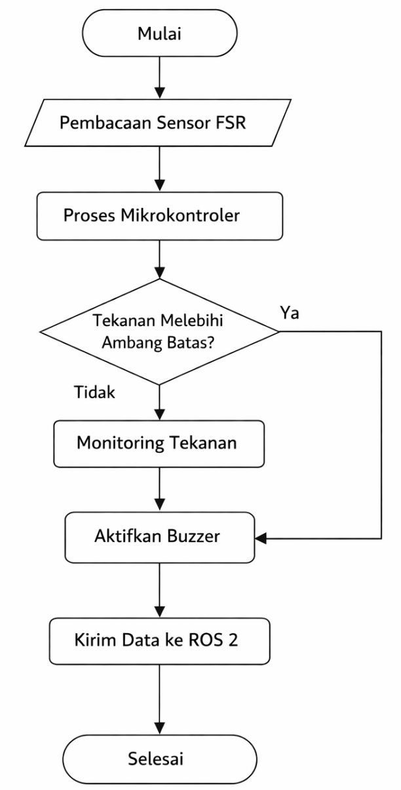
  

 <section> 

</section>
  <h2>Alat dan Bahan</h2>
  <h3>Perangkat Keras (Hardware)</h3>
  

  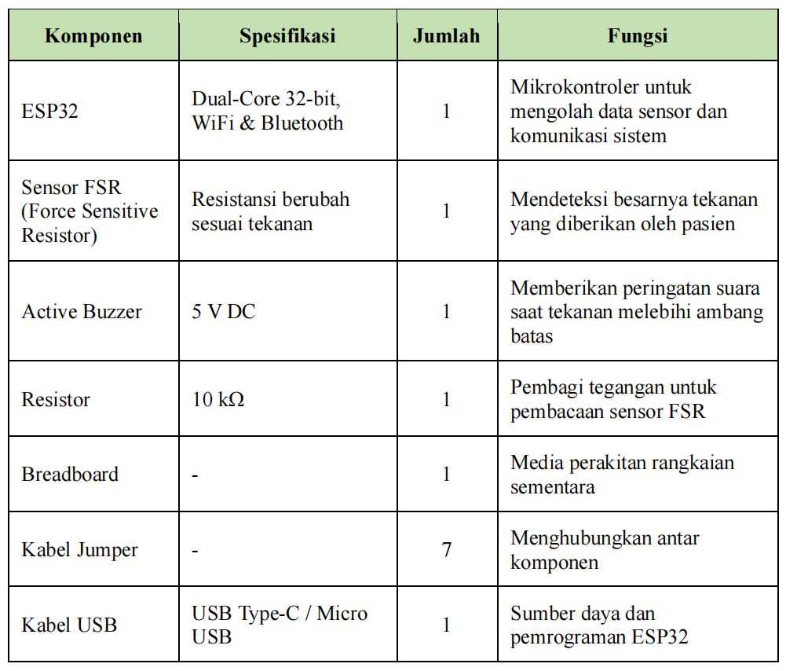 

  <h3>Perangkat Lunak (Software)</h3>
  

  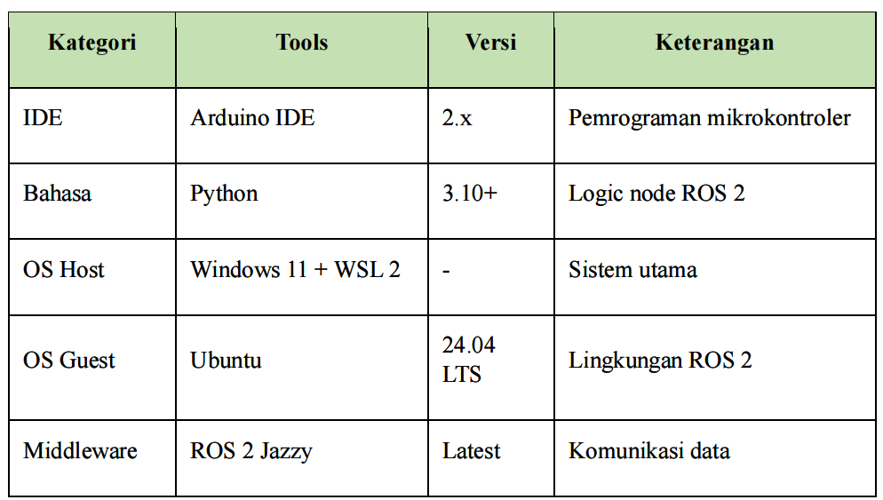

<section>

<h2>Tahap I - Environment Setup</h2>
  

    Tahap ini bertujuan untuk menyiapkan lingkungan kerja perangkat lunak
    agar sistem dapat dikembangkan, dijalankan, dan diintegrasikan dengan
    ROS 2 secara optimal.
  

  <h3>1. Menyiapkan Sistem Operasi Utama (Windows 11)</h3>
  

    Windows 11 digunakan sebagai host system (sistem utama) untuk menjalankan
    seluruh proses pengembangan.
  

    Fungsi Utama:
  <ul>
  
 
    <li>Menjalankan Arduino IDE</li>
    <li>Menjalankan Docker Desktop</li>
    <li>Menjalankan WSL 2 sebagai jembatan ke Linux</li>
  

    <b>Catatan:</b> Pastikan Windows sudah ter-update, virtualisasi aktif di BIOS,
    dan RAM minimal 8 GB.
  

  <h3>2. Mengaktifkan WSL 2 (Windows Subsystem for Linux)</h3>
  

    WSL 2 memungkinkan menjalankan sistem operasi Linux langsung di dalam
    Windows tanpa dual boot.
  

  Langkah-langkah:
  <ul>
  

    <li>Buka PowerShell sebagai Administrator</li>
    <li>Jalankan perintah aktivasi WSL</li>
    
    <li>Lakukan restart sistem komputer</li>
    <li>Pastikan WSL menggunakan versi 2</li>
      

  <h3>3. Instalasi Ubuntu 24.04 LTS</h3>
  

    Ubuntu digunakan sebagai sistem operasi Linux utama untuk menjalankan ROS 2.
  

    Langkah-langkah:
  <ul>
  

    <li>Unduh Ubuntu 24.04 LTS melalui Microsoft Store</li>
    <li>Lakukan Instal dan jalankan</li>
    <li>Buat username dan password pada Linux</li>

  <h3>4. Update Sistem Ubuntu</h3>
  

    Update sistem dilakukan untuk memastikan seluruh package berada pada versi
    terbaru sebelum instalasi ROS 2.
  

    Kode:
  <ul>
  
<i>
  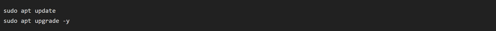

  <h3>5. Instalasi ROS 2 Jazzy Jalisco</h3>
  

    ROS 2 digunakan sebagai middleware komunikasi antara node publisher dan
    subscriber.
  

  Langkah-langkah:
  <ul>
  

    <li>Menambahkan locale sistem</li>
    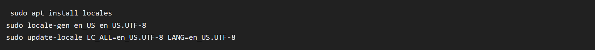
    <li>Menambahkan repository resmi ROS 2</li>
    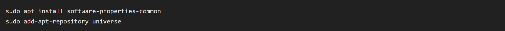
    <li>Menginstal ROS 2 Jazzy Jalisco</li>
    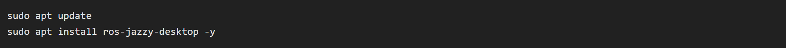
    <li>Melakukan setup environment</li>
    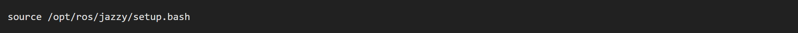
  </ul>

  <h3>6. Instalasi Docker Desktop</h3>
  

    Docker digunakan untuk menjalankan micro-ROS agent secara terisolasi.
  

  Langkah-langkah:
  <ul>
  

    <li>Unduh Docker Desktop for Windows</li>
    <li>Lakukan instalasi dan restart jika diperlukan</li>
    

  <h3>7. Menjalankan micro-ROS Agent</h3>
  

    Micro-ROS Agent berfungsi sebagai penghubung antara mikrokontroler ESP32
    dan ROS 2.
  

  Jalankan container:
  <ul>
  

  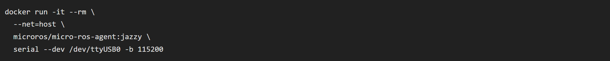

  <h3>8. Instalasi Arduino IDE</h3>
  

    Arduino IDE digunakan untuk pemrograman ESP32 dan pembacaan sensor FSR.
  

   Langkah-langkah:
  <ul>
  

    <li>Instalasi Arduino IDE</li>
    <li>Penambahan board ESP32</li>
    <li>Instalasi library pendukung sensor FSR</li>

  <h3>9. Instalasi Python</h3>
  

    Python digunakan untuk pengembangan node ROS 2 dan monitoring data sensor.
  

    Pastikan Pyhton terinstal:
  <ul>
  

     
  

  Jika belum, lakukan:
  

   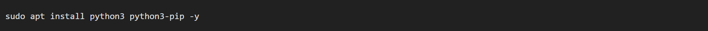

<h2>Tahap II – Perakitan dan Persiapan Perangkat Keras</h2>

Tahap ini bertujuan untuk merakit dan menyiapkan perangkat keras agar sistem dapat
mendeteksi tekanan pada pasien menggunakan sensor Force Sensitive Resistor (FSR)
serta memberikan peringatan otomatis melalui buzzer ketika tekanan melebihi ambang batas.

<h3>1. Persiapan Komponen Hardware</h3>
<ul>
  <li>ESP32 – Mikrokontroler utama</li>
  <li>Sensor FSR – Pendeteksi tekanan</li>
  <li>Buzzer – Alarm peringatan</li>
  <li>Resistor ±10 kΩ – Pembagi tegangan FSR</li>
  <li>Breadboard – Media perakitan sementara</li>
  <li>Kabel jumper</li>
  <li>Kabel USB</li>
</ul>

<h3>2. Wiring Komponen</h3>
<ul>
  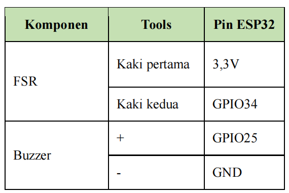 
</ul>

<h3>3. Pemberian Daya dan Koneksi</h3>
<ul>
  <li>Hubungkan ESP32 ke komputer menggunakan kabel USB</li>
  <li>Pastikan ESP32 mendapatkan daya</li>
  <li>LED indikator ESP32 menyala</li>
</ul>

<h3>4. Uji Koneksi Awal</h3>
<ul>
  <li>Buka Arduino IDE</li>
  <li>Pilih Board: ESP32 Dev Module</li>
  <li>Pilih Port sesuai yang terdeteksi</li>
  <li>Pastikan tidak ada error koneksi</li>
</ul>

   <h2>TAHAP III – Arduino Programming</h2>
   

  Tahap ini bertujuan untuk memprogram ESP32 agar dapat membaca data tekanan dari sensor Force Sensitive Resistor (FSR)
  serta mengaktifkan buzzer sebagai alarm peringatan ketika tekanan yang terdeteksi melebihi ambang batas yang telah ditentukan.
  

            
  <h3>1. Persiapan Software</h3>
  <ul>
    <li>Arduino IDE sudah terinstal</li>
    <li>Board yang digunakan: ESP32 Dev Module</li>
    <li>Port COM telah sesuai dengan ESP32 yang terhubung</li>
   <li>Board ESP32 telah ditambahkan ke Arduino IDE</li>
   </ul>
            
  <h3>2. Inisialisasi Komponen</h3>
 
Pada bagian awal program, dilakukan inisialisasi pin dan variabel yang digunakan.

  <ul>
  <li>Menentukan pin analog ESP32 untuk pembacaan sensor FSR</li>
   <li>Menentukan pin digital untuk buzzer</li>
  <li>Menentukan nilai ambang batas tekanan</li>
    
Code Arduino Ide.

 gambar
 </ul>

 <h3>3. Pembacaan Data Sensor</h3>
 
ESP32 membaca nilai tekanan dari sensor FSR secara berkala melalui pin analog.

 <ul>
  <li>Sensor FSR mengubah tekanan menjadi perubahan resistansi</li>
 <li>Nilai resistansi dibaca sebagai tegangan analog oleh ESP32</li>
 <li>Data disimpan dalam variabel <code>fsrValue</code></li>
 <li>Pembacaan dilakukan setiap 500 ms</li>
 </ul>

 <h3>4. Logika Alarm Buzzer</h3>
 
ESP32 mengevaluasi nilai tekanan berdasarkan ambang batas yang telah ditentukan.

 <ul>
 <li>Tidak ada Tekanan → buzzer mati</li>
<li>Ada Tekanan → buzzer aktif</li>
</ul>

<strong>Catatan:</strong> Buzzer berfungsi sebagai alarm peringatan dini untuk membantu tenaga medis mendeteksi kondisi tekanan  pada pasien secara cepat.

</section>

    
</body>
</html>
